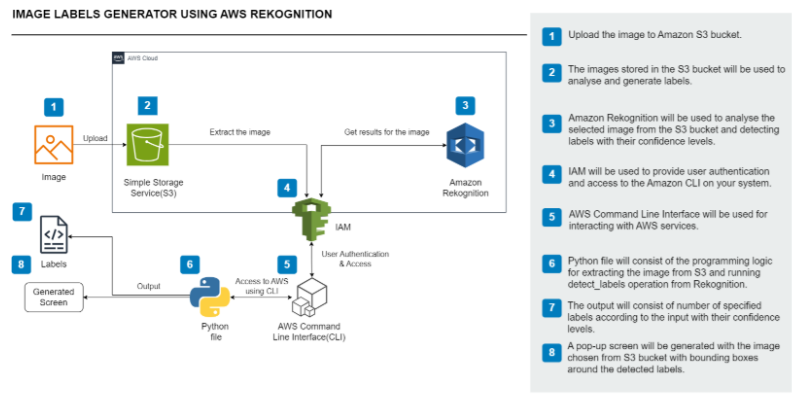
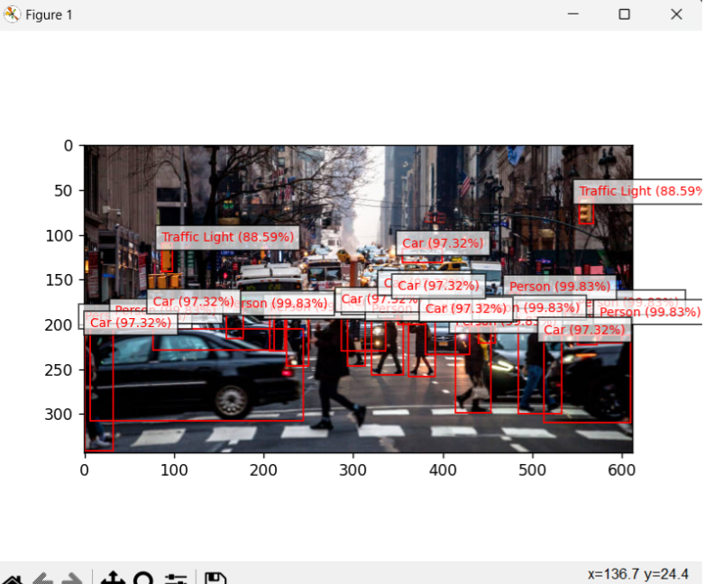

AWS project ☁️ | Image recognition with Amazon Rekognition + S3 + Python

This project demonstrates how to build an image label generator using AWS Rekognition, S3, and Python (boto3). It showcases skills in cloud architecture, serverless AI services, and automation. Upload an image to S3, run the script, and get back labels with confidence scores. Built as part of my AWS Cloud learning portfolio.

Detect objects, scenes, and concepts in your images using **Amazon Rekognition**.  
This repo walks you end-to-end: S3 setup → CLI config → Python code → results in under 30 minutes (and Free Tier friendly).

## 🔧 Services Used
- **Amazon S3** – stores input images
- **Amazon Rekognition** – analyzes images and returns labels
- **AWS CLI** – authenticates your local environment

---

## 🧭 Architecture
1. You upload an image to **S3**.
2. A Python script calls **Rekognition `DetectLabels`** on that S3 object.
3. The script prints labels + confidence scores to your terminal.

```
[You] -> (CLI / Python) -> Rekognition -> Labels
           |
           ---> S3 (image source)
```



---

## ✅ Prerequisites
- Python 3.10+
- An AWS account with access to Rekognition & S3
- AWS CLI installed: https://docs.aws.amazon.com/cli/latest/userguide/
- Configured credentials: `aws configure` (or use a named profile)

> **Never commit credentials.** This repo ignores `.env`, `.aws/`, and similar.

---

## 🚀 Quick Start

```bash
# 1) Clone and install
git clone <YOUR_REPO_URL>
cd aws-rekognition-labels-generator
python -m venv .venv && source .venv/bin/activate   # Windows: .venv\Scripts\activate
pip install -r requirements.txt

# 2) Ensure AWS CLI is configured (choose a region that supports Rekognition, e.g., us-east-1)
aws configure
# or use an existing profile
aws configure --profile myprofile

# 3) Create an S3 bucket and upload an image
aws s3 mb s3://<your-unique-bucket-name> --region us-east-1
aws s3 cp ./screenshots/sample.jpg s3://<your-unique-bucket-name>/sample.jpg
# (put any image you like in ./screenshots then upload)

# 4) Run the script
python app.py --bucket <your-unique-bucket-name> --key sample.jpg --profile default --region us-east-1
```

Example output:
```
Labels for s3://my-bucket/sample.jpg:
- Cat: 99.32% (parents: Mammal, Animal, Pet)
- Furniture: 92.40%
- Indoors: 90.11%
```

---

## 🔐 Minimal IAM Permissions

Use a least-privilege role or user for local testing. Example policy:

```json
{
  "Version": "2012-10-17",
  "Statement": [
    {
      "Effect": "Allow",
      "Action": ["rekognition:DetectLabels"],
      "Resource": "*"
    },
    {
      "Effect": "Allow",
      "Action": ["s3:GetObject", "s3:ListBucket"],
      "Resource": [
        "arn:aws:s3:::<your-unique-bucket-name>",
        "arn:aws:s3:::<your-unique-bucket-name>/*"
      ]
    }
  ]
}
```

Replace `<your-unique-bucket-name>` accordingly.

---

## 🧪 Tips
- Tweak `--max-labels` and `--min-confidence` for your use case.
- For local images, first upload to S3 (Rekognition needs S3 or a byte stream).
- Keep region consistent across S3 and Rekognition.

---

## 🗂 Repo Structure
```
aws-rekognition-labels-generator/
├─ app.py
├─ requirements.txt
├─ .gitignore
├─ docs/
│  └─ architecture.png     # add your diagram here (optional)
└─ screenshots/            # put example images here (optional)
```

---

## 🖥 Add to Your Portfolio
Link the repo and showcase a screenshot + short description. Example HTML card:

```html
<article class="project-card">
  
  <h3>AWS Rekognition Labels Generator</h3>
  <p>Python script that calls Amazon Rekognition to label S3-hosted images, printing results with confidence scores.</p>
  <a href="https://github.com/USERNAME/aws-rekognition-labels-generator" target="_blank" rel="noopener">View on GitHub</a>
</article>
```

Or React (Next.js):

```jsx
export default function ProjectCard() {
  return (
    <div className="rounded-2xl p-5 shadow">
      <h3 className="text-xl font-semibold">AWS Rekognition Labels Generator</h3>
      <p className="mt-2">Labels S3 images with Amazon Rekognition (Python + boto3).</p>
      <a className="mt-3 inline-block underline"
         href="https://github.com/USERNAME/aws-rekognition-labels-generator"
         target="_blank" rel="noreferrer">View on GitHub</a>
    </div>
  );
}
```

---

## 📝 License
MIT (or your choice).

---

## 🙌 Credits
Built by Manshree as part of an AWS learning portfolio.
